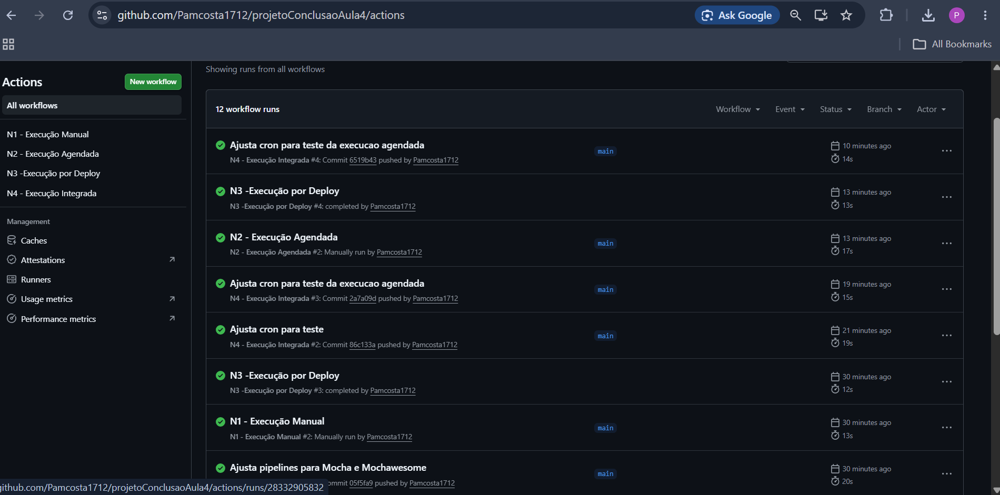
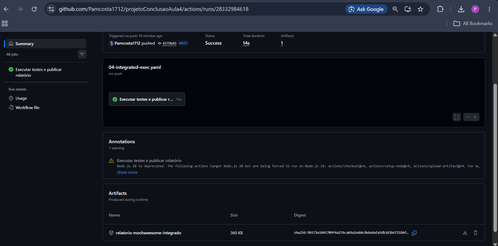
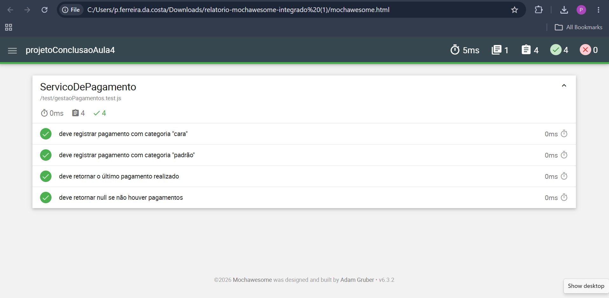

# Projeto de Integracao Continua com GitHub Actions


## Objetivo

Este projeto demonstra a implementacao de uma pipeline de Integracao Continua (CI) com GitHub Actions para executar testes automatizados e publicar relatorios de execucao.

### O que a solucao cobre

- Execucao automatica por push.
- Execucao manual sob demanda.
- Execucao agendada por schedule (cron).
- Execucao de testes automatizados.
- Geracao de relatorio HTML com Mochawesome.
- Publicacao e armazenamento do relatorio como artefato.
- Documentacao completa da abordagem aplicada.

## Sumario

- [Tecnologias Utilizadas](#tecnologias-utilizadas)
- [Estrutura do Projeto](#estrutura-do-projeto)
- [Conceitos Aplicados](#conceitos-aplicados)
- [Workflows Implementados](#workflows-implementados)
- [Execucao Local](#execucao-local)
- [Publicacao de Relatorios](#publicacao-de-relatorios)
- [Evidencias Obtidas](#evidencias-obtidas)
- [Evidencias Visuais](#evidencias-visuais)
- [Conclusao](#conclusao)

## Tecnologias Utilizadas

| Tecnologia | Papel no projeto |
| --- | --- |
| GitHub | Repositorio e colaboracao |
| GitHub Actions | Automacao da pipeline CI |
| Node.js | Ambiente de execucao JavaScript |
| Yarn | Gerenciamento de dependencias e scripts |
| Mocha | Execucao dos testes automatizados |
| Mochawesome | Geracao de relatorio de testes em HTML/JSON |

## Estrutura do Projeto

```text
projetoConclusaoAula4
|
+-- .github
|   +-- workflows
|       +-- 01-manual-exec.yaml
|       +-- 02-scheduled-exec.yaml
|       +-- 03-post-deploy-exec.yaml
|       +-- 04-integrated-exec.yaml
|
+-- src
|   +-- gestaoPagamentos.js
|
+-- test
|   +-- gestaoPagamentos.test.js
|
+-- package.json
+-- yarn.lock
+-- README.md
```

## Conceitos Aplicados

### Integracao Continua (CI)

Integracao Continua e uma pratica de desenvolvimento em que alteracoes de codigo sao integradas frequentemente em um repositorio compartilhado, com validacoes automaticas e rapidas por meio de pipelines.

### Beneficios da abordagem

- Deteccao antecipada de falhas.
- Automatizacao das validacoes.
- Maior confiabilidade nas entregas.
- Reducao de atividades manuais.

### GitHub Actions

GitHub Actions e a ferramenta nativa de automacao do GitHub para criar pipelines CI/CD por meio de workflows em YAML.

Local dos workflows neste projeto:

```text
.github/workflows
```

### Testes Automatizados

Framework utilizado: Mocha.

Comando para executar os testes:

```bash
yarn test
```

### Relatorios de Teste

Ferramenta utilizada: Mochawesome.

Informacoes presentes no relatorio:

- Quantidade de testes executados.
- Sucessos.
- Falhas.
- Tempo de execucao.
- Detalhamento dos cenarios.

Comando para gerar o relatorio:

```bash
yarn test:report
```

Arquivos gerados:

```text
mochawesome-report/
+-- mochawesome.html
+-- mochawesome.json
```

## Workflows Implementados

### 1. Execucao Manual

- Arquivo: 01-manual-exec.yaml
- Gatilho: workflow_dispatch
- Uso: permite execucao manual via botao Run workflow.

### 2. Execucao Agendada

- Arquivo: 02-scheduled-exec.yaml
- Gatilho: schedule
- Uso: executa automaticamente em horarios definidos.

Exemplo de cron:

```yaml
schedule:
  - cron: "5 * * * *"
```

### 3. Execucao por Push

- Arquivo: 03-post-deploy-exec.yaml
- Gatilho: push
- Uso: executa automaticamente a cada envio de alteracoes ao repositorio.

### 4. Execucao Integrada

- Arquivo: 04-integrated-exec.yaml
- Gatilhos: workflow_dispatch, push, schedule

Etapas executadas:

- Instalacao das dependencias.
- Execucao dos testes automatizados.
- Geracao do relatorio Mochawesome.
- Publicacao do relatorio como artefato da execucao.

## Execucao Local

### 1. Instalar dependencias

```bash
yarn install
```

### 2. Executar testes

```bash
yarn test
```

### 3. Gerar relatorio

```bash
yarn test:report
```

## Publicacao de Relatorios

Apos a execucao da pipeline, o relatorio e publicado automaticamente como artefato do GitHub Actions.

Para visualizar:

1. Acesse a aba Actions no repositorio.
2. Selecione uma execucao concluida com sucesso.
3. Baixe o artefato relatorio-mochawesome.

## Evidencias Obtidas

Durante a execucao do projeto, foi validado:

- Execucao por push.
- Execucao manual.
- Execucao agendada (schedule).
- Testes automatizados com sucesso.
- Geracao de relatorio HTML com Mochawesome.
- Armazenamento do relatorio como artefato.
- Pipeline executando com sucesso no GitHub Actions.

## Evidencias Visuais

### Pipeline executada com sucesso



### Workflow integrado



### Relatorio Mochawesome



## Conclusao

A solucao desenvolvida aplica conceitos de Integracao Continua com GitHub Actions, automatizando a execucao de testes e a geracao de relatorios.

Com isso, o projeto entrega maior confiabilidade, rastreabilidade e qualidade no processo de desenvolvimento de software.
